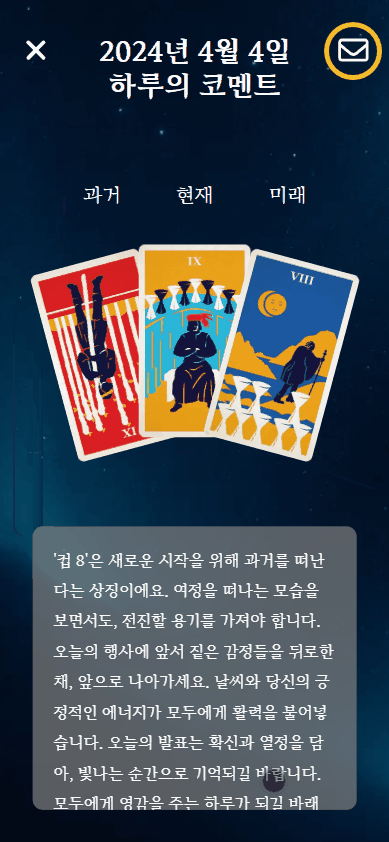

# 💌 **밤 편지**

> 당신의 하루를 위로 하는 타로카드 기반 다이어리 : 밤 편지

`SSAFY_서울_10기 특화 프로젝트 : 빅데이터 추천`

### 밤편지를 써 보세요 🎯

- 일기를 작성하며 하루를 마무리하고 싶다면 📝
- 하루를 공감하며 기쁨은 배로, 슬픔은 반으로 나누고 싶다면 😃 
- 내 하루와 비슷한 하루를 보낸 다른 사람의 이야기가 궁금하다면 👩🏼‍🤝‍🧑🏾

 

`밤 편지`는 오늘 하루를 기록하고 다시 돌아볼 수 있는 `다이어리`입니다.

 

다이어리를 작성하면,
1. 오늘 하루를 특별하게 기억할 수 있도록 타로카드 한 장을 타로카드가 나타내는 의미와 함께 제공해줍니다.
2. 과거, 현재, 미래 카드를 기반으로 하루를 공감해주는 코멘트와 함께 미래 방향을 제시해줍니다.
3. 나와 비슷한 하루를 보낸 다른 사람의 이야기를 볼 수 있습니다.

 

---

## 💌 주요 기능

### 카카오 소셜 로그인, 메인 화면

- 오늘 하루를 나타내는 3장의 타로카드가 표시됩니다.
- 좌우로 스와이프하여, 이전에 작성한 다이어리를 확인할 수 있습니다.
- 타로카드를 클릭하여, 다이어리 내용을 확인할 수 있습니다.

  

### 타로카드 뽑기, 일기 작성

- `밤 편지`는 과거, 현재, 미래를 나타내는 3개의 카드로 해석하는 Three Card Spread 방식을 사용합니다.
- 과거에 쓴 일기가 없다면, 과거를 나타내는 타로카드 한 장을 뽑습니다. 
- 일기를 작성하여 오늘 보낸 하루를 대표하는 타로카드를 한 장을 받습니다.
- 일기를 작성한 후, 미래를 나타내는 타로카드 한 장을 뽑습니다.
- `사연으로 공개하기`를 누르면, 다른 사람에게 내 일기가 공개될 수 있습니다.

  

  

### 하루 코멘트, 사연 추천

- 작성한 일기와 과거, 현재, 미래 3장의 타로카드로 오늘 하루를 해석해주고, 미래에 대한 방향을 제시해 줍니다.
- 나와 비슷한 하루를 보낸 다른 사람의 사연들을 추천 받습니다.

  

---

## 💌 주요 기술

### 1. 포팅 매뉴얼

[포팅 매뉴얼](./assets/porting-manual.md)
 

### 2. 시스템 아키텍쳐

 

### 3. 타로카드 추천

- 타로카드 156장(정방향, 역방향) 각각의 의미를 나타내는 5개의 키워드로 전처리 합니다.
- KoSBERT 모델을 이용하여 각각의 키워드를 768차원의 임베딩 벡터 값으로 나타냅니다.
- 사용자가 입력한 일기 전처리하고, KoSBERT 모델을 이용하여 768차원의 임베딩 벡터 값으로 나타냅니다.
- 일기와 타로카드의 키워드를 코사인 유사도를 통해 유사한 정도를 수치화 합니다. 
- 5개의 유사도를 `평균 + 최대값`이 가장 높은 카드를 선정하여 일기를 대표하는 타로카드로 추천합니다.

 

글의 유사도를 비교하기 위해서 임베딩 벡터를 이용한 방법은 널리 사용되는 방법입니다. 반의어를 구분해야 했기 때문에 Doc2Vec 모델이 아닌
Bert 모델을 선택하였고, 한글의 특성을 잘 살려서 학습시킨 KoSBERT 모델로 글자를 임베딩 벡터로 나타냈습니다. 이 후, 코사인 유사도 공식을 통해
두 벡터간의 유사도를 비교하여 일기의 의미와 유사한 타로카드를 찾을 수 있었습니다.

타로카드를 추천하는 과정에서, 코사인 유사도의 값들을 `평균` 과 `최대값`의 합을 이용하여 가장 유사한 의미를 갖는 타로카드를 추천했습니다.
타로카드가 갖는 5개의 키워드의 유사도가 `평균`적으로 높다면 가장 유사하다고 생각할 수 있습니다. 
하지만 일부 타로카드의 경우, 한 키워드만이 나타내는 상징적인 의미가 큰 키워드가 있다는 것을 발견했고,
이를 반영하기 위해 여러 시행착오 끝에 `평균 + 최대값`을 이용하여 타로카드를 추천하였습니다. 

> ref : BM-K/Sentence-Embedding-Is-All-You-Need https://github.com/BM-K/Sentence-Embedding-Is-All-You-Need

 

### 4. 비슷한 일기 추천

- 사용자가 작성한 일기를 KoSBERT 모델을 이용하여 768차원의 임베딩 벡터 값으로 나타냅니다.
- ANNOY 알고리즘을 이용하여 가장 유사한 일기들을 추천합니다.
  - 모든 일기들을 벡터로 변환하고, Tree 형태로 저장해둡니다.
  - 작성된 일기 벡터와 유사한 일기를 ANNOY 알고리즘을 통하여 Tree에서 ID값을 찾습니다.
  - 반환된 ID 값을 바탕으로 공개여부, 작성된 본인인지, 일기가 존재하는지 확인하여 사용자에게 제공합니다.

비슷한 일기를 추천하는 방법에는 Spotify가 개발한 ANN(Approximate Nearest Neighbor) 기반의 ANNOY 알고리즘을 사용하였습니다.
ANN 알고리즘은 정확도를 약간 포기한 대신 성능을 높이는 것에 목적을 둔 알고리즘입니다.
그 중 ANNOY 알고리즘은 이진 트리의 구조를 갖고 있어 O(log N)의 속도로 엄청난 성능을 자랑합니다. 또한, 하이퍼 파라미터 설정에 따라
빌드 속도를 포기하는 대신 정확성도 올릴 수 있는 구조를 갖고 있어, ANN을 대표하는 알고리즘으로 볼 수 있습니다.

하지만, ANNOY 알고리즘은 데이터가 추가됨에따라 Tree를 다시 빌드해야 된다는 단점을 갖고 있습니다. 저희 Data팀은 이를 해결하고자
HNSW(Hierarchical Navigable Small World Graphs)의 도입을 고려해봤습니다. 하지만, HNSW의 경우 파라미터 튜닝의 중요성이
높았고, 구현 방식이 복잡하다는 단점이 있었습니다. 또한 NHN Cloud의 레퍼런스를 참고해 보았을 때, 150만건 ~ 250만건 이상의 데이터를 처리할 때 한계를 느껴 HNSW로 전환한 사례를
찾을 수 있었습니다.  

이러한 이유들로 ANNOY 알고리즘을 우선적으로 선택하였고, 추후 서비스 고도화가 필요하게 되면 HNSW로 전환하기로 결정하였습니다.

> ref : ANNOY Algorithm https://github.com/spotify/annoy \
> ref2 : NHN Cloud : NHN FORWARD 22 https://www.youtube.com/watch?si=wYvWqiYFzX5UDr6R&v=hCqF4tDPNBw&feature=youtu.be

  

---

## 💌 팀원 소개

### 📆 프로젝트 기간 ( 24.02.19 ~ 24.04.05 )

- 기획 및 설계 : 24.02.19 ~ 24.03.10
- 프로젝트 구현 : 24.03.11 ~ 24.04.01
- 버그 수정 및 산출물 정리 : 24.04.02 ~ 24.04.05

 

<table>
    <tr>
        <td height="140px" align="center"> <a href="https://github.com/heon118">
                이승헌  </a>  </td>
        <td height="140px" align="center"> <a href="https://github.com/hyojin030">
                 김효진  </a>  </td>
        <td height="140px" align="center"> <a href="https://github.com/olrlobt">
                 이승헌  </a>  </td>
        <td height="140px" align="center"> <a href="https://github.com/youngkimi">
                 김영섭  </a>  </td>
        <td height="140px" align="center"> <a href="https://github.com/lainlnya">
                 김예림 </a>  </td>
        <td height="140px" align="center"> <a href="https://github.com/NamjunKim12">
                 김남준  </a>  </td>
    </tr>
    <tr>
        <td align="center">팀장 Infra</td>
        <td align="center">Data</td>
        <td align="center">Data Backend</td>
        <td align="center">Backend</td>
        <td align="center">Frontend</td>
        <td align="center">Frontend</td>
    </tr>
</table>

  

### 💌회고

- [이승헌(팀장)](https://github.com/heon118) : 팀장으로써 기술적인 부분에서 도움을 주지 못해서 아쉬운 생각이 있었습니다. 백엔드와 빅데이터를 도와주며 함께 공부하고 싶었는데 생각보다 배포가 오래 걸려 그렇게 하지 못한 것이 아쉽고 팀원들에게 미안했습니다. 팀원들이 개발하기 더 편한 환경으로 배포해주지 못했기에 이런 부분을 공부해봐야겠다는 생각을 했습니다.
- [김효진](https://github.com/hyojin030) : 관심 있던 추천 시스템에 대해 배우고 구현해 볼 수 있어서 좋은 경험이었습니다. 일기를 추천한다는 주제가 흔치 않아 고민하는 시간이 길었지만, 그만큼 평범하지 않아 즐거운 과정이었습니다. 기회가 된다면 사용자의 데이터를 받아 더 맞춤화된 추천으로 만족도 높은 서비스를 개발해 보고 싶습니다.
- [이승헌](https://github.com/olrlobt) : 새로운 기술들에 많이 도전하면서 배움이 많았던 프로젝트였습니다. Fast API, ANNOY 알고리즘, KoSBERT, GPT 파인튜닝 등 다양한 기술에 많이 도전하며 부딪히면서 성장했던 기간이었습니다. 이 프로젝트에서 많은 도전을 한 덕분에, 앞으로 새로운 기술을 만나게 되어도 두려워하지 않을 자신이 생겼습니다. 한 가지 아쉬운 점은 JIRA 사용을 적극적으로 하지 않았다는 점입니다. 일정이 하나 둘 밀리기 시작하면서 처음 기획가 달라진 부분이 많이 보여서 아쉽습니다. 다음에는 일정 관리에 더욱 몰두하겠습니다.
- [김영섭](https://github.com/youngkimi) : 아직 엉성한 부분이 많아 차근차근 개선해나가야할 것 같습니다. 초기 기획했던 것보다는 프로젝트 사이즈가 많이 줄어들어 아쉽습니다. 기획적으로 보다 완성도 있는 프로젝트를 위한 몇 가지 기능을 추가하고, 단위 테스트 작성과 안정적 서비스 제공, 성능 개선을 위한 리팩토링 작업이 필요하겠다는 생각이 듭니다.
- [김예림](https://github.com/lainlnya) : 마지막에 시간에 쫓겨 최적화를 하지 못한 점이 아쉬웠습니다. 또한 타로카드가 뽑혀질 때 로딩 시간 없이 카드가 갑작스럽게 뽑히는 느낌이 들어 사용자 경험 향상을 위해 개선해보고 싶다는 생각이 들었습니다.
  프론트엔드 팀원과 코드리뷰를 하며 진행하면 서로의 부분을 디버깅하거나, 구조를 일관성있게 유지하는 것에 도움이 되지 않았을까 하는 아쉬움이 남았습니다. 다음 번에는 코드리뷰를 도입하여 서로의 코드에 대해 피드백을 갖는 시간이 있었으면 좋을 것 같습니다.
- [김남준](https://github.com/NamjunKim12) : 프로젝트에 도입할 기술에 대해 공부하며 근거있는 기술을 선정하기 위해 노력했고, useEffect 의 생명주기에 관련된 트러블 슈팅 과정에서 기술의 작동원리를 더 잘 파악해야겠다는 생각이 들었습니다.
